# Hi, I'm Robby Pambudi

**Full-stack developer** based in Surabaya · Python, web products, and learning quantum computing

[Website](https://robbypambudi.com) · [LinkedIn](https://www.linkedin.com/in/robbypambudi) · [X](https://x.com/robbypambudii) · [dev.to](https://dev.to/robbypambudi)

  
  
  
  
  

---

### About me

- Full-stack developer at **techflouu**, building with TypeScript / React / Next.js and **Python**
- Exploring distributed LLM systems, RAG pipelines, and developer tooling in Python
- Currently learning **quantum computing** — algorithms, circuits, and how they meet classical software
- Always open to collaboration — feel free to reach out

### Featured projects

| Project | What it is |
| --- | --- |
| [**next-template**](https://github.com/robbypambudi/next-template) | Next.js starter for event, organization, or personal sites · [demo](https://next.robbypambudi.com/) |
| [**DiLLeMA**](https://github.com/robbypambudi/DiLLeMA) | Extensible framework for distributed LLM computing on GPU clusters (Python) |
| [**RAGforge**](https://github.com/robbypambudi/RAGforge) | Production-ready RAG template · [demo](https://chat.robbypambudi.com) |

### Tech stack

**Languages & frameworks**

**Data & tools**

### Stats

  
  
   
  

### Contribution snake

  <picture>
    <source media="(prefers-color-scheme: dark)" srcset="https://raw.githubusercontent.com/robbypambudi/robbypambudi/output/github-contribution-grid-snake-dark.svg" />
    <source media="(prefers-color-scheme: light)" srcset="https://raw.githubusercontent.com/robbypambudi/robbypambudi/output/github-contribution-grid-snake.svg" />
    
  </picture>

---

Thanks for stopping by — more at [robbypambudi.com](https://robbypambudi.com)

